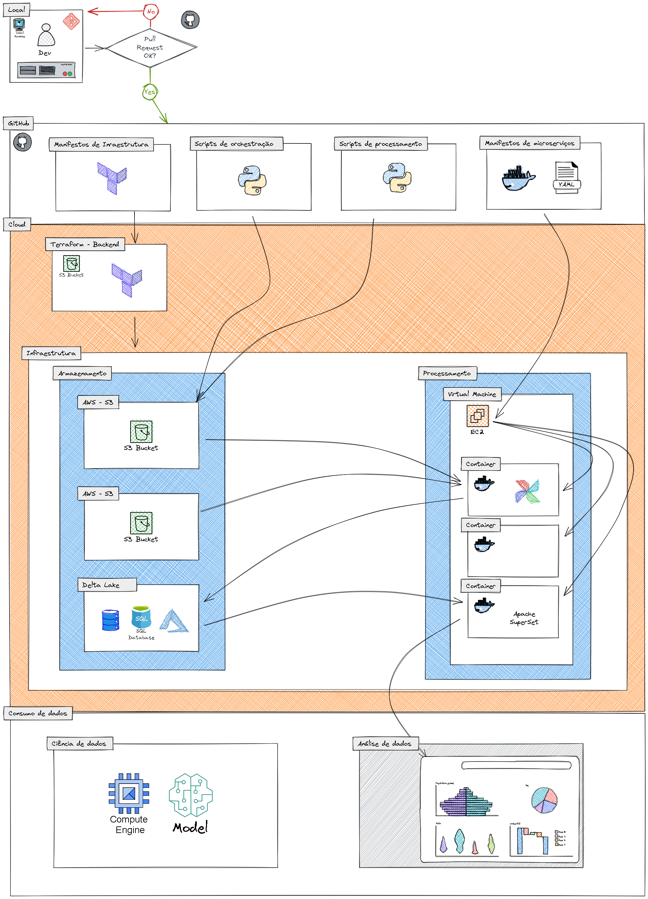

# projeto_brasileirao

 
Esse repositório é destinado a interesses meramente educacionais, sem qualquer fim lucrativo. Trata-se de uma dentre muitas formas de se implementar uma aplicação de dados, desde a Engenharia até a Análise.
 
 

____________________________________________________________________________________________________
### Motivação ou "problema a ser resolvido":
 
Esse projeto nasceu a partir da observação de uma necessidade de estatísticas avançadas (análise de dados) assim como de um modelo de previsão (ciência de dados) de resultados do campeonato brasileiro de futebol.
 
 

____________________________________________________________________________________________________
### Proposta de solução:
 
Criar uma aplicação de dados que seja capaz de manter-se atualizada, e fornecer tanto um dashboard para as estatísticas quanto os dados preparados para alimentação de modelos de aprendizagem de máquina e inteligência artificial.
 
 

____________________________________________________________________________________________________
### Levantamento de requisitos e arquitetura:
 

#### Requisitos gerais:
- Como o projeto tem a finalidade educacional há que se procupar em utilizar ferramentas open-source com a finalidade de não se gerar custo e ainda assim poder demonstrar que é possível executar um trabalho de elevado nível de complexidade técnica com ferramentas que se tornaram padrão de mercado ao redor do mundo.
 

#### Arquitetura sugerida:

 

#### Fluxograma funcional da aplicação:

 

#### Provedor de serviços cloud e Continuous Integration:
- Cloud: Amazon Web Services (AWS)
- CI: GitHub
 
 

Para mais detalhes consulte o documento completo [levantamento_de_requisitos_para_aplicação_de_dados.md]() na pasta documentação ou clique neste [link]() para acessá-lo diretamente.
 
 

____________________________________________________________________________________________________
### Novo titulo:
